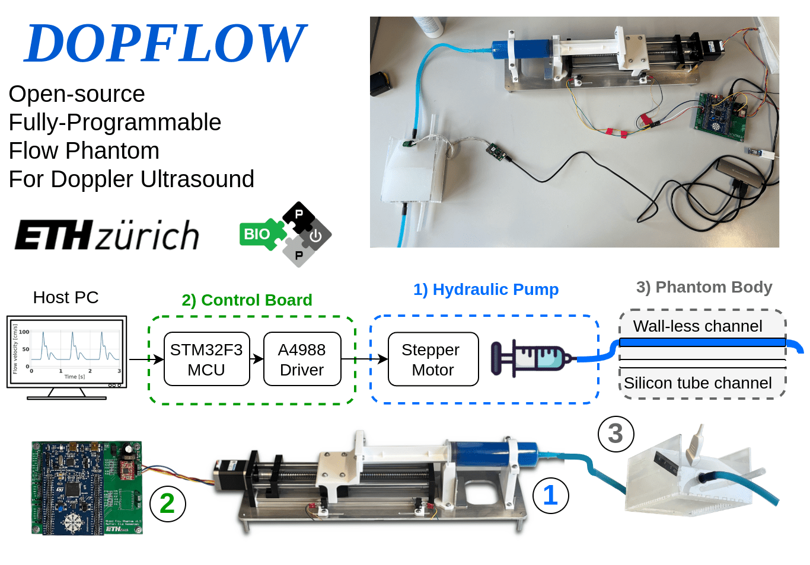

# DOPFLOW: 
## Open-Source Fully-Programmable Flow Phantom for Doppler Ultrasound
### Introduction

This repository contains the design files to reproduce the DOPFLOW system presented at IUS Joint Symposium 2024 [1], 

DOPFLOW is an all-in-one Doppler Flow Phantom system that mimics the common carotid artery.
The platform has a modular design using off-the-shelf parts, including
- Custom syringe-based hydraulic pump, 
- Control printed circuit board, 
- Phantom body with both walled and wall-less channels,
- Graphical User Interface. 

The platform allows users to define pulsatile patterns and achieve maximum flow speeds over 1 meter per second. We've validated DOPFLOW with a commercial ultrasound Doppler machine (SONIXRP), showing a velocity estimation error of less than 15%. These capabilities, plus the system's low cost (< 400$) and open-source design, make DOPFLOW a promising research tool for developing new Doppler ultrasound technologies.

### Structure
This repository has the following folders:
- `docs`, containing the images and user manual (future work).
- `control_board`, containing the source files to reproduce the control board.
- `hydraulic pump`, containing the source files to reproduce the hydraulic pump.
- `phantom`, containing the source files to reproduce the phantom structure, mimicking the common carotid artery and surrounding tissue.
- `software`, containing the source files for the graphical user interface (GUI) to control the motor.

### Usage

- First, fabricate the phantom body, the hydraulic pump, then assemble and program the control board using the instructions in the corresponding folders of the repository.
- Next, connect the PC to the control board, connect the hydraulic pump to the control board (motor and limit swicthes) and power up the control board from the lab power supply (12 V, 2A).
- Connect the phantom to the syringe pump with a silicone hydraulic line. 
- Run the Graphical User interface and move the syringe with commands to fill in the volume with the blood-mimicking fluid.
- Place the ultrasound transducer on the phantom, execute the custom pulse profile and make the measurements.

# Citation

[1] - Vostrikov Sergei et. al, "Open-Source Fully-Programmable Flow Phantom for Doppler Ultrasound." 2024 IEEE Ultrasonics, Ferroelectrics, and Frequency Control Joint Symposium (UFFC-JS). IEEE, 2024.

If you would like to reference the project, please cite the following paper:

```
@inproceedings{vostrikov2022opensource,
  title={Open-Source Fully-Programmable Flow Phantom for Doppler Ultrasound},
  author={Vostrikov, Sergei and Josquin, Tille and Nazemtsev, Ilia and Benini, Luca and Cossettini, Andrea},
  booktitle={2024 IEEE Ultrasonics, Ferroelectrics, and Frequency Control Joint Symposium (UFFC-JS)},
  pages={1--4},
  year={2024},
  organization={IEEE}
}
```

# Authors

The DOPFLOW system was developed at the [Integrated Systems Laboratory (IIS)](https://iis.ee.ethz.ch/) at ETH Zurich by:
- [Sergei Vostrikov](https://scholar.google.com/citations?user=a0KNUooAAAAJ&hl=en) (System design, Technical Supervision, Open-Sourcing)
- [Josquin Tille](https://www.linkedin.com/in/josquin-tille-829a341a7/) (Mechanical/PCB/Software design of the final prototype)
- [Nazemtsev Ilia](https://www.linkedin.com/in/ilia-nazemtsev/) (Mechanical/PCB/Software design of the initial prototype, Materials/Components selection)
- [Luca Benini](https://scholar.google.com/citations?hl=en&user=8riq3sYAAAAJ) (Supervision, Conceptualization)
- [Andrea Cossettini](https://scholar.google.com/citations?user=d8O91jIAAAAJ&hl=en) (Supervision, Project administration)


# License
Please see the [LICENSE_README.md](./LICENSE_README.md) for a summary of license information.

## Limitation of Liability
In no event and under no legal theory, whether in tort (including negligence), contract, or otherwise, unless required by applicable law (such as deliberate and grossly negligent acts) or agreed to in writing, shall any Contributor be liable to You for damages, including any direct, indirect, special, incidental, or consequential damages of any character arising as a result of this License or out of the use or inability to use the Work (including but not limited to damages for loss of goodwill, work stoppage, computer failure or malfunction, or any and all other commercial damages or losses), even if such Contributor has been advised of the possibility of such damages.