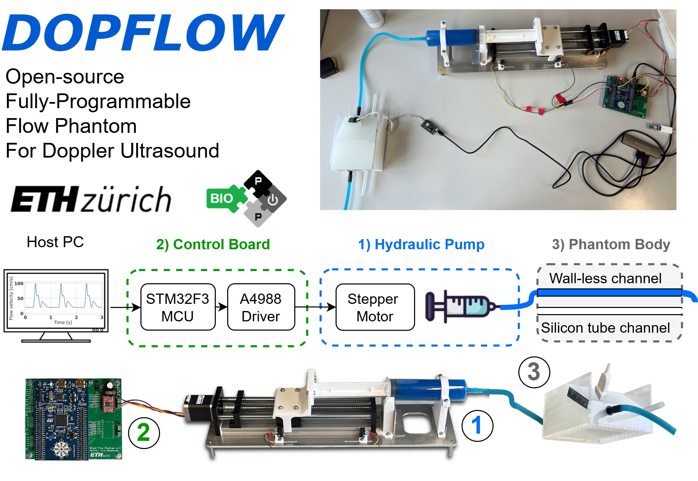

# DOPFLOW: 
## Open-Source Fully-Programmable Flow Phantom for Doppler Ultrasound
# Introduction

This repository contains the design files to reproduce the DOPFLOW system presented at IUS Joint Symposium 2024 [1].

DOPFLOW is an all-in-one Doppler Flow Phantom system that mimics the common carotid artery.
The platform has a modular design using off-the-shelf parts, including
- Custom syringe-based hydraulic pump, 
- Control printed circuit board, 
- Phantom body with both walled and wall-less channels,
- Graphical User Interface. 

The platform allows users to define pulsatile patterns, achieves maximum flow speeds over 1 meter per second and was validated with a commercial ultrasound Doppler machine (SONIX RP). These capabilities, plus the system's low cost (< 300 $) and open-source design, make DOPFLOW a promising research tool for developing new Doppler ultrasound technologies.

# Structure of the repository
This repository has the following folders:
- `control_board`, containing the source files to reproduce the control board.
- `hydraulic pump`, containing the source files to reproduce the hydraulic pump.
- `phantom`, containing the source files to reproduce the phantom structure, mimicking the common carotid artery and surrounding tissue.
- `software`, containing the source files for the graphical user interface (GUI) to control the motor.
- `docs`, containing the project documentation (e.g., images of the device, user manual, ...)

# Documentation 

The comprehensive [DOPFLOW User Manual](docs/dopflow_user_manual.pdf) located in the `docs/` folder, provides complete information on the DOPFLOW system, from assembly instructions to a detailed GUI overview. It’s designed to make the platform accessible and user-friendly for all, regardless of technical background.

# How to reproduce?

In a nutshell, to set up your own instance of DOPFLOW, follow these steps:

1. *Fabricate and assemble the hardware*<br>
   First, fabricate the phantom body and the hydraulic pump, then assemble and program the control board using instructions from the chapter 2 of the  [User Manual](docs/dopflow_user_manual.pdf) 

2. *Python dependencies installation on the host PC*<br>
   Follow the instructions in the `./software/` folder to install the dependencies.

# Usage

Please refer to chapter 3 of the [DOPFLOW User Manual](docs/dopflow_user_manual.pdf) for detailed information.

1. *Connect and power the control board*<br>
   Connect the PC to the control board, attach the hydraulic pump to the control board (connecting both the motor and limit switches), and power the control board using a 12 V, 2A lab power supply.

2. *Connect the phantom to the hydraulic pump*<br>
   Use a silicone hydraulic line to connect the phantom to the syringe pump.

3. *Run the graphical user interface (GUI)*<br>
   Launch the GUI, and use the controls to move the syringe and fill the phantom with the blood-mimicking fluid.

4. *Place the ultrasound transducer and perform measurements*<br>
   Position the ultrasound transducer on the phantom, run the custom pulse profile, and proceed with the measurements.

# Citation

[1] - Vostrikov Sergei et. al, "Open-Source Fully-Programmable Flow Phantom for Doppler Ultrasound." 2024 IEEE Ultrasonics, Ferroelectrics, and Frequency Control Joint Symposium (UFFC-JS). IEEE, 2024.

If you would like to reference the project, please cite the following paper:

```
@inproceedings{vostrikov2022opensource,
  title={Open-Source Fully-Programmable Flow Phantom for Doppler Ultrasound},
  author={Vostrikov, Sergei and Tille, Josquin and Nazemtsev, Ilia and Benini, Luca and Cossettini, Andrea},
  booktitle={2024 IEEE Ultrasonics, Ferroelectrics, and Frequency Control Joint Symposium (UFFC-JS)},
  pages={1--4},
  year={2024},
  organization={IEEE}
}
```

# Authors

The DOPFLOW system was developed at the [Integrated Systems Laboratory (IIS)](https://iis.ee.ethz.ch/) at ETH Zurich by:
- [Sergei Vostrikov](https://scholar.google.com/citations?user=a0KNUooAAAAJ&hl=en) (System design, Technical Supervision, Open-Sourcing)
- [Josquin Tille](https://www.linkedin.com/in/josquin-tille-829a341a7/) (Mechanical/PCB/Software design of the final prototype)
- [Nazemtsev Ilia](https://www.linkedin.com/in/ilia-nazemtsev/) (Mechanical/PCB/Software design of the initial prototype, Materials/Components selection)
- [Luca Benini](https://scholar.google.com/citations?hl=en&user=8riq3sYAAAAJ) (Supervision, Conceptualization)
- [Andrea Cossettini](https://scholar.google.com/citations?user=d8O91jIAAAAJ&hl=en) (Supervision, Project administration)


# License
Please see the [LICENSE_README.md](./LICENSE_README.md) for a summary of license information.

## Limitation of Liability
In no event and under no legal theory, whether in tort (including negligence), contract, or otherwise, unless required by applicable law (such as deliberate and grossly negligent acts) or agreed to in writing, shall any Contributor be liable to You for damages, including any direct, indirect, special, incidental, or consequential damages of any character arising as a result of this License or out of the use or inability to use the Work (including but not limited to damages for loss of goodwill, work stoppage, computer failure or malfunction, or any and all other commercial damages or losses), even if such Contributor has been advised of the possibility of such damages.