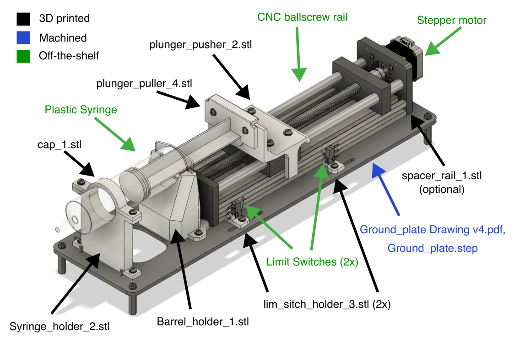

# ASsembly of the Hydraulic Pump
In this folder, you can find the files necessary to build the syringe based hydraulic pump.

For a step-by-step assembly instruction, please refer to the User manual located in `/docs/` folder of the root directory of the repository.

## Machined part
- `Ground_plate Drawing v4.pdf`, `Ground_plate.step`, are the plans to build the ground plate on which the component are mounted. It is made from a 5mm thick 500mm x 135mm aluminum plate. The pdf techincal drawing includes the specifications for the tolerances and threads

## 3D Printed parts
The 3D printed parts are printed with PLA using FDM printing
- `Barrel_holder_1.stl`, `Syringe_holder_2.stl` and `cap_1.stl` are the three element connecting the the syringe to the base plate
- `plunger_puller_4.stl` and `plunger_pusher_2.stl` are connecting the plunger to the CNC rail.

- `lim_sitch_holder_3.stl` needs to be printed 2x, once normaly and once **mirrored** along the xz plan

- `spacer_raiL1.stl` can be inserted between the end plate on the motor side of the CNC rail and the aluminum extrusion of the CNC rail if the motor's shaft is too long and extends into the ballscrew mechanism. 

## Off the shelf parts to order

Off the shelf parts have to be order online. More iformation about the products as well as links to the providers are found in the Bill of material: `pump_BOM.xlsx`
### Coupling CNC rail with step motor
The CNC motor comes with a coupling however it does not fit the step motor shaft's diamter. You should order a motor coupling with diameter 6mm and 8mm. 

## Assembly visual description
For assembly refer to the assembly video: https://youtu.be/GyMb5HX_3No.

The image below maps the names of the files to the components. 

 

## Screws and Dowel pins 
Dowel pins for alignement: **ISO 2338 - ⌀4 h6 x 10mm** (7x)

Screws and washer:
- **Ground plate to CNC rail**: Stainless Steel Pan Head Slotted Screws **M6 x 15mm** + M6 washer (4x)
- **Plunger pusher to CNC rail**: Stainless Steel Pan Head Slotted Screws **M5 x 15mm** + M5 washer (4x)
- **Step motor to CNC rail**: Stainless Steel Pan Head Slotted Screws **M3 x 12mm** + M3 washer (4x)
- **Limit switch to lim stich holder**: Stainless Steel Pan Head Slotted Screws **M2 x 15mm** + M2 hex nut (2x) and M2 washer (4x)
- **All other Screws**: Stainless Steel Pan Head Slotted Screws **M4 x 15mm** + M4 hex nut (10x)  and M4 washer (20x)

- **4 support legs**: spacer, hex, M4 X 12mm

## Adjustment of the Limit Switches
The swithes can be mounted on the oblong holes on the side of the ground plate. To find the right position, 
- Start by mounting the Switches onto the holder. 
- Turn ballscrew mannualy until the syringe is almost empty (before the plunger touches the bottom of the barrel).
- Adjust the position of the holder so that the switch bumps into the plunger pusher and closes the circuit. 
- Turn ballscrew mannualy until the syringe is almost full (before the syringe breaks open).
- Adjust the position of the second holder so that the switch bumps into the plunger pusher and closes the circuit. 