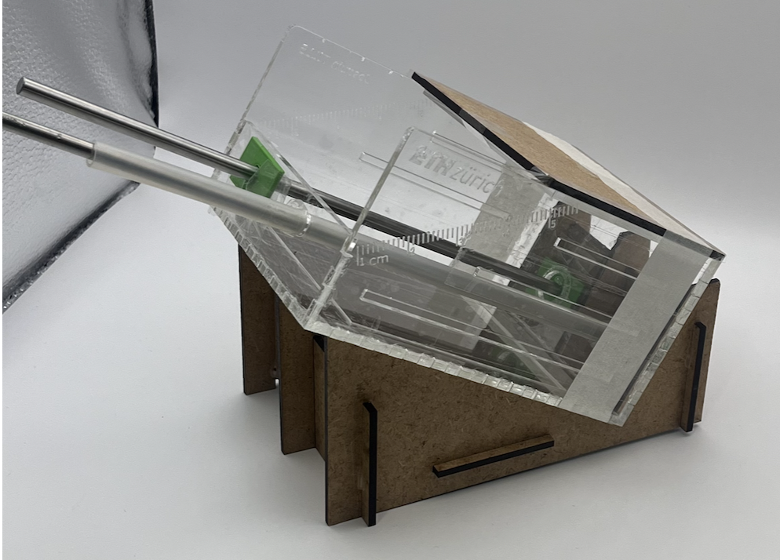
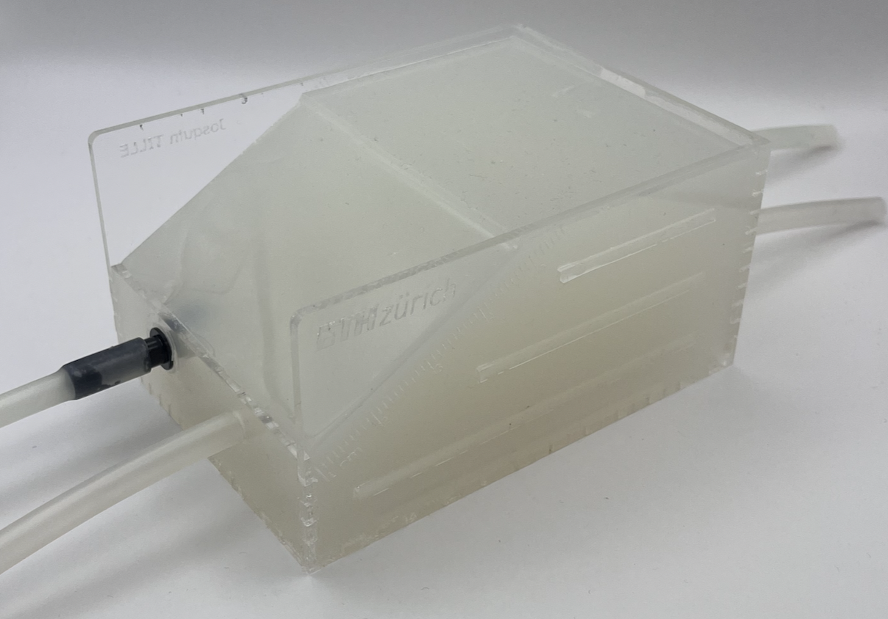

# Phantom's body fabrication

This directory contains the necessary instructions and files for fabricating a phantom body, including materials and steps for creating both walled and wall-less channels.

For a step-by-step manufacturing and assembly instructions, please refer to the User manual located in `/docs/` folder of the root directory of the repository.

## Summary of the Fabrication Steps

1. **Acrylic Frame Laser Cutting**
    - Laser cut the file `AcrilicBoxV4.svg` in acrylic and assemble the box using [acrifix glue](https://link-url-here.org).
    - Laser cut the `support_consturction_blocks.svg` using wither plywood or acrylic. 

   
   
2. **Prepare the Mold**
   - Insert a **silicone tube** (6 mm inner diameter) into pre-arranged holes in the frame. You can also add a metalic rod int the tube to ensure it will stay straight.
   - Place a **steel rod** (6 mm diameter) for the wall-less channel. TIP: coat the steel rod with petrolum jelly for easier removal
   - Seal all the open holes with transparent tape. You can print `phantom_hole_lid.stl`to cover the holes of the wall-less channel.
   - Place the frame onto the suport blocs

3. **Filling with Tissue-Mimicking Material**
   - Prepare a tissue-mimicking silicone rubber material (EcoFlex 30, Smooth-On, USA).
   - Mix part A and B with a 1:1 ratio.
   - Degas the EcoFlex silicone for **60 seconds** under a medium vacuum level (**15-20 mbar**) to remove any air bubbles.
   - After degassing, pour the silicone into the acrylic frame.
   - Allow the silicone to cure for **4 hours**.

4. **Removing the Sacrificial parts**
   - Once cured, carefully remove the steel rod from the phantom, leaving behind a **cylindrical wall-less channel**.
   - Remove all other sacrificial parts.
   - Insert the inlet to conect the wall-less channel to a conveyor silicon tube.

---

This process results in a phantom body with both walled and wall-less channels.
